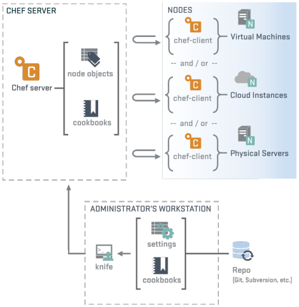

# Devops-Tech-talk : CHEF
---------------
Team Members:
----
- Ashwin Bharadwaj Lakshmi Venkataramanan (alakshm6)
- Gaurav Aradhye (garadhy)
- Stuti Nanda (snanda)

# About the Tool:

Chef is a Configuration Management tool which automates how the infrastructure is configured, deployed and configured across networks on machines which could be physical, on cloud or virtual. The use of such a tool helps in ensuring that the files, softwares, packages and services are present on the respective machines and are working as required.  
  
The need for such tool arises from the fact that the real world applications require management of multiple server machines each performing a different function. Manual management of operations and configuration in such an environment can be a daunting task and hence this calls for tools like Chef which provide Infrastructure as Code.  

# Architecture and Components :  
Chef follows a pull mechanism where in the client nodes pull the data from the server and compare this data with what they have. Any mismatch would cause a complete fetch from server and overwritten on the node and accordingly executed. This data is referred to in the Chef terminology as the recipe. These recipes are developed on workstations by developers/admins and then pushed on to the servers. The client nodes will pull periodically from the server they are configured to talk to and perform the related tasks. All such recipes and configurations are placed within cookbooks.   

Client nodes are configured to talk to servers and each client node could be assigned a role, viz. db, appserver etc. The recipes corresponding to these roles will have details like configuration, packages to be installed, services to be brought up, actions to be taken on various resources. The configuration can also detail about which db an appserver might have to connect to thereby providing an infrastructure where the client nodes could talk to one another by establishing connections.

 
 

 
 

Image courtesy: doesnotscale.com

 
  
#### Workstation : 
These are machines on which developers/admins develop the configuration files/recipes to be used by the chef client nodes upon pushing to chef server. You can bootstrap new chef nodes from your workstation. The workstation is connected with the Version controlling system where you can sync your code with.
  
#### Chef Server :
The cookbooks and recipes are pushed on to the chef server which is the source for the client nodes to pull their recipes from. The client nodes are configured to interact with the chef server using a pull mechanism which is detailed in the description of the chef client.

Chef Server stores the metadata of all the nodes and provides search service for the nodes.
  
#### Chef Client :
The client nodes are configured to interact with the chef server using a pull mechanism wherein the chef client periodically polls for any change in the configuration and accordingly pull and overwrite the current recipe with that existent on the server. The client nodes are configured to perform certain roles as database, appserver, etc. The chef clients can also be configured to interact with other client nodes by establishing connections thereby establishing a full blown application with an application and database running behind it.

# Installation Instructions :

**Quick Setup:**

For starting, you can use the free account on enterprize chef server available on "manage.chef.io". You can create an account on the website and create a new organization.
Then you can download the chef starter kit, it will contain all the basic authentication keys, and a sample cookbook.

Once the start kit is downloaded to your machine, you can right away start writing cookbooks and the upload them to the chef server using knife command.

In the same way, you can bootstrap your new node (you will need IP address, username, password/ssh_key), may it be a physical machine, a container, local VM or a VM running on a cloud platform. Any kind of machine with above basic details can act as a chef node.

**Long / Personalized Setup:**

If you need to have your own chef server in your environment, then please follow the steps on official Chef website. <a href=https://docs.chef.io/install_server.html> https://docs.chef.io/install_server.html </a>

# Advantages : 
Chef is an established community with a good user base contributing to the community. This makes it easier for navigating through any related issues. Furthermore, chef recipes can be shared, for example, a recipe for deploying LAMP stack could be shared on the marketplace and someone looking for LAMP stack could pick it up and use it for their use case. It has weathered a lot since its inception and hence is technologically more mature than many CM alternatives.  
  
Chef is Idempotent and hence any un-intended changes made to the nodes can be fixed within a short span, which happens using the pull mechanism, wherein it observes a difference between the contents on the server and on the node and fetches the server copy.

# Disadvatages : 
The biggest disadvantage Chef poses for people adopting it newly is the learning curve it has in learning Ruby. Chef requires writing out the recipes in Ruby and hence non-developers might not find it an easy adoption. Chef has a complex environment and in comparison to Ansible it seems pretty bulky in performing the same tasks.   
Although, the pull mechanism and idempotence form a good feature, enough damage could be inflicted when the time period for successive pull's is high. In addition to that, sometimes a change on the server will not lead to immediate change on the nodes owing to the absence of push mechanism and hence there is a lag between deploying something to the chef server and the same being reflected on the nodes.  

# Our verdict :
Adoption of such tools is always very use case specific and as we have observed throughout our experience with Chef, it is a tool which could be used when someone has a good experience with programming, a plus if Ruby is known, and the use case requires managing a complex infrastructure which could require support through online community. In addition to that Chef provides idempotence and hence presence of multiple users and possibly some of them having access to nodes directly could prevent the distortion of configuration by way of ensuring consistency with chef server. Also that chef market place has multiple recipes available online which could be plugged in to the requirements and hence reduce time of development.  

But if the use case is pretty simple with not much of a infrastructure to manage and if the infrastructure management is done by sysadmins then Ansible being a light weight tool might be a better option.

# Sample Example :
The example that we demoed had following steps followed.

1. We created two cookbooks, "apache" and "apt". The default recipe in the apache cookbook has the steps which installs and starts apache2 service. Then it copies a static html page and image file to a particular directory on the node.

    You can create new cookbooks using command:
    <pre>chef cookbook create cookbook_name</pre>

2. We uploaded the cookbooks to the chef server using command.

   <pre>chef cookbook upload cookbook_name</pre>

3. We boostrapped a new node on amazon AWS and passed the two cookbooks as the runlist. A new node can be bootstrapped using following command:

    <pre> chef bootstrap < node_ip_address >   -N   < local_node_name >   -x   < user_name >  -i   < private_key_path.pem >  --sudo   -r "recipe[cookbook_1], recipe[cookbook_2]"  </pre>
    
 
Once above steps are executed, a new node will be bootstrapped and all the recipes will be downloaded and run in given order. You can go to the browser and see that apache server is running on the node.

This is all explained in the vide below.

<a href=https://www.youtube.com/watch?v=NMk2TJU2z6A> https://www.youtube.com/watch?v=NMk2TJU2z6A </a>

# DEMO : 

#### Screencast :

<a href=https://www.youtube.com/watch?v=NMk2TJU2z6A>Demo Screencast</a>

# Presentation : 

[Presentation] (https://github.com/stutinanda/devops-techtalk/blob/master/Tech%20Talk%20-%20Chef.pptx)

In case the video in the presentation doesn't work, please refer to [Video] (                       https://www.youtube.com/watch?v=g_0UZe6R5pk)

## Further Reading: 
- [Chef](https://www.chef.io/chef/)
- [Tutorials](https://learn.chef.io/tutorials/)
